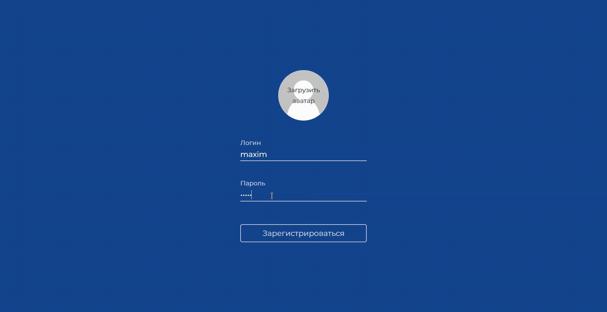
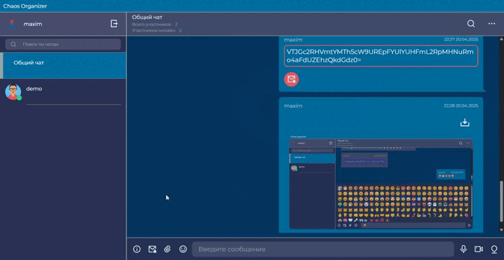

## Установка и запуск проекта для локальной работы

Шаг 1. Клонирование репозитория

```
git clone https://github.com/maxter9595/ahj-diploma.git
cd ahj-diploma
```

Шаг 2. Настройка env и запуск бэкенда

Пример для бэкенда (папка backend, см. .env.example):

```
PORT=10000
```

Запуск серверной части:

```
cd backend
npm install         # Установка зависимостей
node server.js      # Запуск сервера
```

Шаг 3. Настройка env и запуск фронтенда

Пример для фронтенда (папка frontend, см. .env.example):

```
BASE_URL=http://localhost:10000
WS_URL=ws://localhost:10000
```

Запуск фронтенда:

```
cd frontend
npm install
yarn start
```

Загрузка проекта и его запуск относительно localhost:


## Сервер и деплой. Запуск проекта с сервером


Server: [https://ahj-diploma-6967.onrender.com](https://ahj-diploma-6967.onrender.com) (порт 10000)

Deployment: Github Pages


Запуск проекта относительно веб-сервера (render.com). В этом случае просто: 

• убираем переменные окружения, если они есть

• убеждаемся в наличии необходимых ссылок для подключения к веб-серверу. В самом коде пример уже приведен по умолчанию

• Запускаем фронтенд с рабочим веб-сервером


## Вход в приложение

Для быстрого входа в приложение вводим следующие данные на странице авторизации - логин: `demo`, пароль: `demo`.


---

## Реализованные функции

### Обязательные для реализации функции (5/5)

• Сохранение ссылок и текстовых сообщений в истории


---

• Ссылки должны быть кликабельны и отображаться как ссылки


---

• Сохранение в истории изображений, видео и аудио (как файлов), с отображением превью файла - через Drag & Drop и через иконку загрузки (скрепка в большинстве мессенджеров). 

Загрузка файла при помощи иконки загрузки:


Загрузка файла при помощи Drag & Drop:


---

• Скачивание файлов (на компьютер пользователя)


---
• Ленивая подгрузка: сначала подгружаются последние 10 сообщений, при прокрутке вверх подгружаются следующие 10 и т.д.


---

### Дополнительные для реализации функции (13/17)

• Авторизация/регистрация - при первом открытии приложения будет предложено авторизоваться или зарегистрироваться. Чтобы авторизоваться необходимо ввести свой логин и пароль и нажать на кнопку `войти`. 

Изначально доступен один пользователь - логин: `demo`, пароль: `demo`. При успешной авторизации произойдет вход. При ошибке авторизации будет показано уведомление об ошибке. 

Авторизация:


Для регистрации необходимо нажать на кнопку `регистрация`, затем ввести новый логин и придуманный пароль и нажать кнопку `зарегестрироваться`. 

Регистрация:


Для выхода из аккаунта необходимо нажать кнопку `выход`

Выход из аккаунта:


---

• Возможность загрузки аватара при регистрации. Для загрузки аватара необходимо нажать на иконку `загрузить аватар`. Откроется стандартное окно выбора файлов. Выберите необходимый файл. После выбора изображения появится превью аватара.

Загрузка аватара:



---

• Синхронизация - если приложение открыто в нескольких окнах (вкладках) или с разных устройств, то контент будет синхронизироваться.


---

• Запись видео и аудио (используя API браузера). Для записи видео или аудио нужно нажать соответствующую иконку, после этого начнется запись и будет отображен таймер. 

Начать и отменить запись:


Для остановки и отправки записи необходимо нажать на иконку слева от таймера, для отмены записи нужно нажать на иконку справа от таймера.

Отправить запись:


---

• Воспроизведение видео/аудио (используя API браузера)


---

• Отправка геолокации и просмотр объекта в отдельном окне браузера в google картах при клике на кнопку.


---

• Статус пользователя - если пользователь онлайн, то его аватар помечен маркером (зеленый кружок) у всех участников чата, если пользователь нажал кнопку "выход" маркер изчезает у всех пользователей.


---

• Просмотр вложений по категориям, например: аудио, видео, изображения, другие файлы (см. боковую меню Telegram)


---

• Поиск по сообщениям (интерфейс + реализация на сервере). Поиск осуществляется по тексту сообщения


---

• Поддержка смайликов (emoji)


---

• Отправка зашифрованных сообщений и файлов (привет crypto-js!) с просмотром расшированных (для этого нужно ввести пароль) - важно эта функция засчитывается за две.

Для того чтобы отправить зашифрованное сообщение необходимо нажать на соответствующую пиктограмму (письмо с замком).

Далее будет предложено придумать пароль для расшифровки сообщения, после того как пароль будет введен и нажата кнопка `сохранить`, пиктограмма станет красного цвета и следующее отправленное текстовое сообщение или файл будут зашифрованны. 

Для расшифровки сообщения необходимо нажать на соответствующую пиктограмму на самом сообщении и ввести пароль. Каждый пароль действует для одного сообщения, отправленного после сохранения пароля. 

Отправка зашифрованного сообщения:


---

• Отправка команд боту, например: @chaos: погода, бот должен отвечать прогноз погоды (интеграция с реальными сервисами)

Для того чтобы получить информацию о доступных командах, необходимо нажать на соответствующую пиктограмму (см. рисунок ниже)



---

• Поддержка оформления кода, например, при отправке сообщения в бэктиках. 


